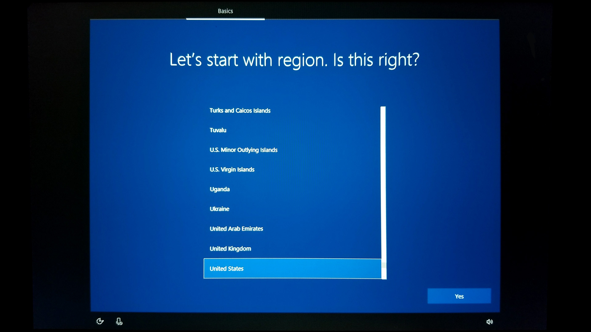
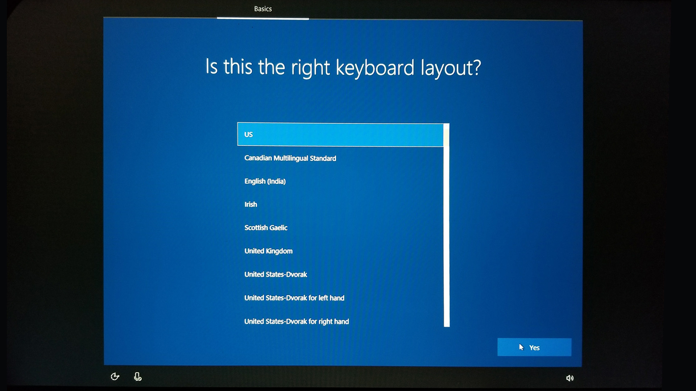
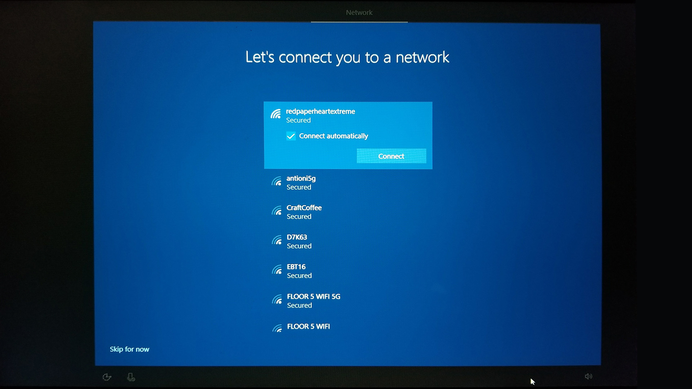
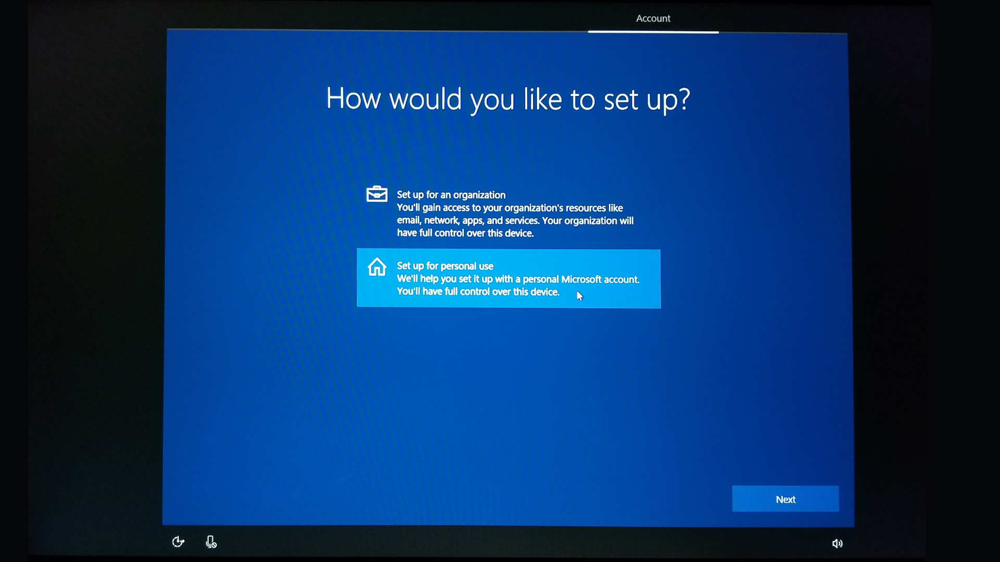
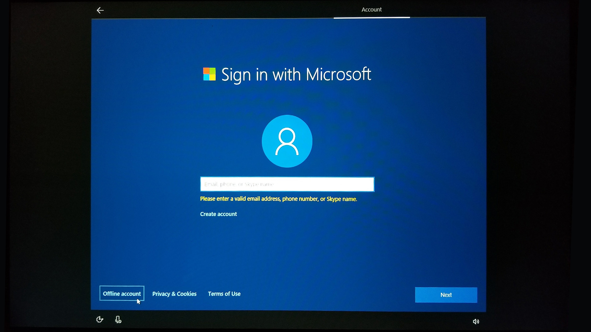
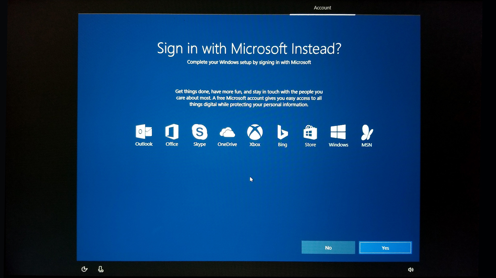
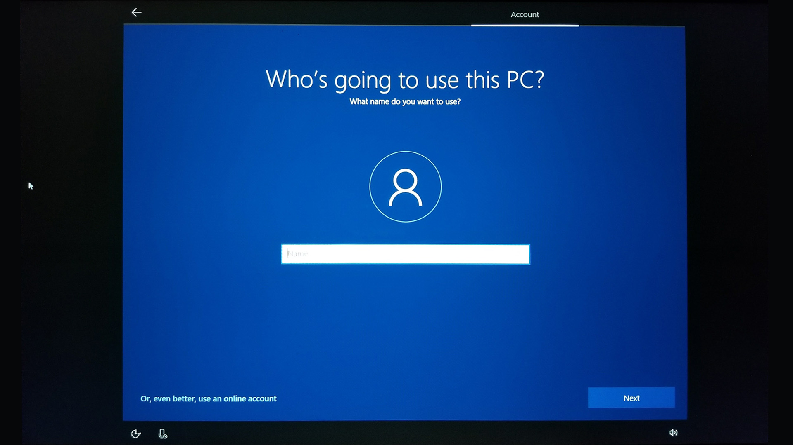
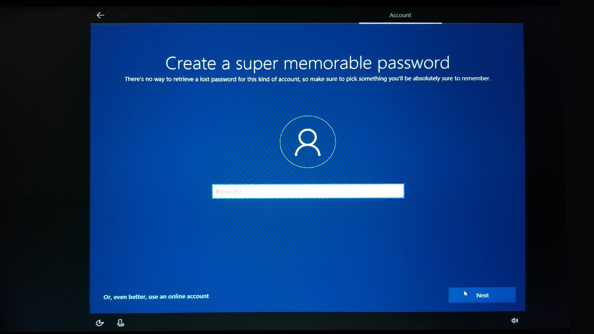
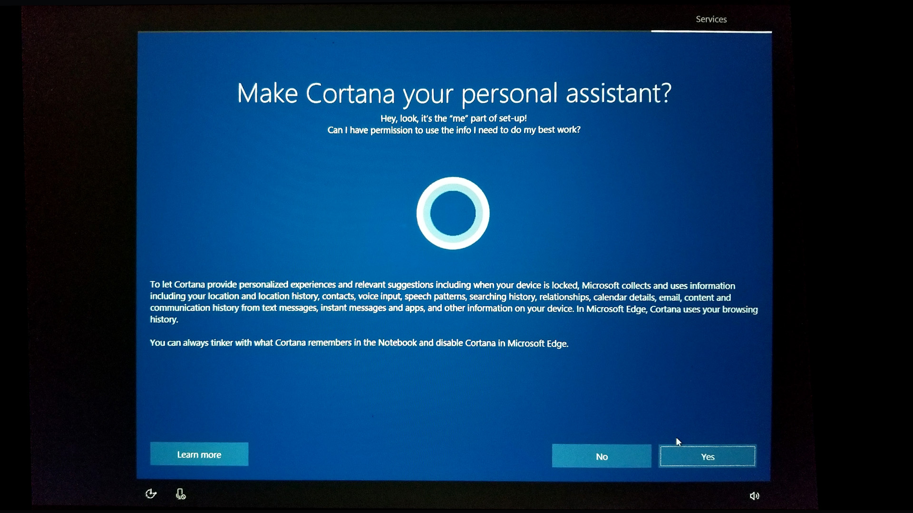
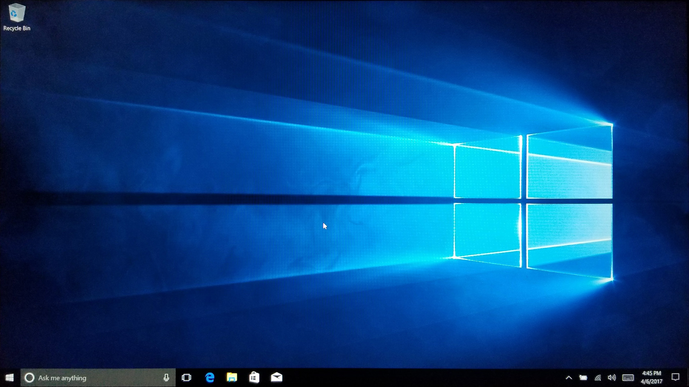

## Windows 10 install script

This is a base template for setting up a Windows 10 PC to run as an installation computer.

## Hardware Installation & Setting

### Hardware Overview

**Computer**: (Name of the computer)

**Specs**: (CPU, Ram, Graphics card)

**OS**: Windows 10 Pro 64-bit

**Network**: Requires ethernet connection to backend API

**Displays**: (Resolution, Brand, and Display technology)

### Hardware set up instruction
A guide to set up the Windows PC from scratch with offline user

#### Windows 10 Set up
##### Initial Windows Configuration

- Set up windows
	- Language: English
	

	- Keyboard
	

	- Connect to the network (if using wifi, ethernet should just work)		

	- Set up for personal use
	

	- Use an offline account
	

	- Do not sign in with Microsoft
	

	- Give this User a name that does not include any empty spaces: (RPHAdmin)
	

	- Create a password: (RPH1234)
	

	- Do NOT make Cortana your personal assistant: click NO
	

	- Turn off all privacy settings
	

	- Once ready, set local timezone
	

	- Update windows
		- Go to 'Settings -> Update & Security -> Windows Update'
		- Click 'Check for Updates'
	- Switch off automatic updates
	Please follow all steps in this tutorial.
	On windows 10, this is the only reliable solution:
	[https://www.cnet.com/how-to/meter-your-ethernet-connection-in-windows-10/](https://www.cnet.com/how-to/meter-your-ethernet-connection-in-windows-10/)

	- Deactivate Screensaver
	If your application produces visual output you don’t want a screensaver interrupting that.
		- Control Panel > Appearance and Personalization > Personalization > Screen Saver
		- Or: Click the magnifying glass icon in the lower left corner of the desktop and search for “Screen saver” to open the control panel.
		- Click “Change screen saver” to open the control panel.
		- Under “Screen saver”, select “(None)” to disable all screen savers.
		- Also make sure the item “On resume, display logon screen” is disabled.
		- Close the “Screen saver” control panel by clicking OK.

	- Set a custom desktop image or background color.
		- Control Panel > Appearance and Personalization > Background
		-  Choose 'Picture' from the drop down menu and choose your picture.
		-  Browse to find the picture for your desktop.
		-  You can also choose the "fit" for your picture to fill or tile the picture.
		-  If you have more than one display you can right click on the "Choose your picture" thumbnails to choose which display the image will appear on.
  
	- Power Options
	You don’t want your computer falling asleep due to a lack of mouse/keyboard input.
		- Windows Settings > System > Power & Sleep
		- Or: Click the magnifying glass icon in the lower left corner of the desktop and search for “Power & Sleep” to open the control panel.
		- Under "Screen", set "When plugged in, turn off after" to "Never"
		- Under "Sleep", set "When plugged in, PC goes to sleep after" to "Never"
		- Click on "Additional Power Settings" - a new window opens.
		- Under “Choose or customize a power plan”, find the item “Show additional plans”.
		- Click on the arrow icon next to “Show additional plans”. A new item becomes visible.
		- Select “High performance”.
		- Click on “Change plan settings” of the “High performance” item."
		- Select “Never” for “Turn off the display”
		- Select “Never” for “Put the computer to sleep”
		- Click on “Save changes” to confirm.
		- Close the “Power management” control panel.

	- [Enable automatic login](http://pcsupport.about.com/od/windows-8/fl/auto-logon-windows-8.htm)

	- Deactivate Notifications
		- Open up "Notifications & actions" settings.
		- Set all the notification options to off.

	- Deactivate edge swipe gestures, if using a touch enabled device.
	Follow the instructions here to disable edge gestures:
	[https://www.tenforums.com/tutorials/48507-enable-disable-edge-swipe-screen-windows-10-a.html](https://www.tenforums.com/tutorials/48507-enable-disable-edge-swipe-screen-windows-10-a.html)

	##### Network access
	- Setup your PC with [static IP](https://kb.netgear.com/27476/How-to-set-a-static-IP-address-in-Windows)

## Software Installation & Settings

(Software installation will be unique for each project install, fill out the sections below, add additional sections where appropriate)

### Software Installation & Setup
#### PC

1. **Setting up base software packages**
	- Useful applications and Utilities to install
		- [Chrome](https://www.google.com/chrome/)
		- Text Editor ([VS Code](https://code.visualstudio.com/) or [Atom](https://github.com/atom/atom/releases/tag/v1.31.2))
		- [VLC](https://www.videolan.org/vlc/index.html)
		- [7-Zip](https://www.7-zip.org/)
		- Node
		- Python
		- Log Me In

2. **Set up your App**
   
	(How to install your application: run installer, copy files, etc)

	**Configuring the App**

	(How to configure settings for your application: edit config files, configure IPs, etc)

	**Application Monitoring**

	(How to configure application monitoring and reporting)

3. **Startup Scripts**
	(How to launch application on computer startup)

	#### Example batch file launcher
	1. Create a batch (.bat) file to launch your application, place in the same folder as the application
		- Your batch file will likely not launch your application directly, but instead launch your application monitoring utility (AMPM) which will then launch your application and keep it running.
	2. Create a shortcut to the batch file
		- open file explorer and go to the .bat file
		- right click on the .bat file and select "Create Shortcut"
	3. Once the shortcut has been created, right-click the shortcut and select "Cut"
	4. Press the Start button and type `Run` and press enter.
	5. In the Run window, type `shell:startup` to open the Startup folder.
	6. Once the Startup folder has been opened, click the Home tab at the top of the folder and
	7. select "Paste" to paste the shortcut into the folder.

	Once you restart the computer. This shortcut will run your batch file.

5. **Configuring PC downtime**
To allow the application and computer some downtime, configure the computer to shutdown and startup by itself. Both startup and shutdown need to be configured separately.
	- To setup automatic startup you need to enable the setting in the BIOS. These instructions may be different depending on your computers BIOS so you may need to google the exact steps, but here is an example. Also some computers might not have an option for automatic startup.
		1. Reboot the computer and hold down `F2` This should launch the BIOS setup.
		2. When the menu appears, open up `Power Management` then click on `Auto On Time`
		3. Then select the time you would like the computer to turn on at, be sure `Every Day` is selected.
		4. Then click `Exit` The machine will now automatically turn on at the configured time everyday.

	- To configure automatic shutdown you will need to make a new task in the task scheduler.
		1. Open the Task Scheduler, press `WIN+r` then type in `taskschd.msc` press OK
		2. Click on the `Task Scheduler Library` then make a new folder to hold the task; give it a good name `MyApplicationTasks`
		3. Select the new folder, then choose Action -> Create Task...
		4. Name the task Shutdown, choose to `run whether user is logged on or not` and `Configure for: Windows 10`
		5. Then select the Trigger tab, click `New` and configure what time you'd like the computer to shut down. Then click OK.
		6. Then select the Actions tab, click	`New` Make the Action `Start a Program` then in the Program/script field type in `C:\Windows\System32\shutdown.exe` and in the Add arguments field enter `-s` Then click OK
		7. Your task should be ready to run. Your computer should now shut down at the configured time.
		8. There are also additional shutdown arguments that can be passed to force shutdown (-f) or add a delay (-t 60)

### Using the application
(What is the application? What does it do? What should Users see on screen?)

#### Key Commands
(Outline all of the keyboard shortcuts for your application: Fullscreen toggle, Dev Panel toggle, etc)

#### In App Configurations
(Any additional configuration that needs to happen)

### Trouble Shooting
Most issues should be resolved with a restart. The simplest way to restart is to access the computer shelf in the back of the wall and then turn off the power strip located there, wait 5 seconds then turn it back on. The computer and LED screen should boot back up and relaunch the app. If the problem persists it may be a more complex problem.

# Other useful tasks and utilities
1. **Running a Node application as a service**
	- [node-windows](https://github.com/coreybutler/node-windows) allows you to install and run a node application as a service on your machine. This is great for any small utilities (application monitoring or reporting) that need to run in the background in addition to your application.

2. **Monitoring Utilities**
	- [AMPM](https://github.com/stimulant/ampm) is a great utility for monitoring applications and keeping them running.
	- [Restart on Crash](https://w-shadow.com/blog/2009/03/04/restart-on-crash/) is a simple utility for launching applications and keeping them running. It is not as customizable as AMPM, but allows you to launch multiple apps and keep them all running.